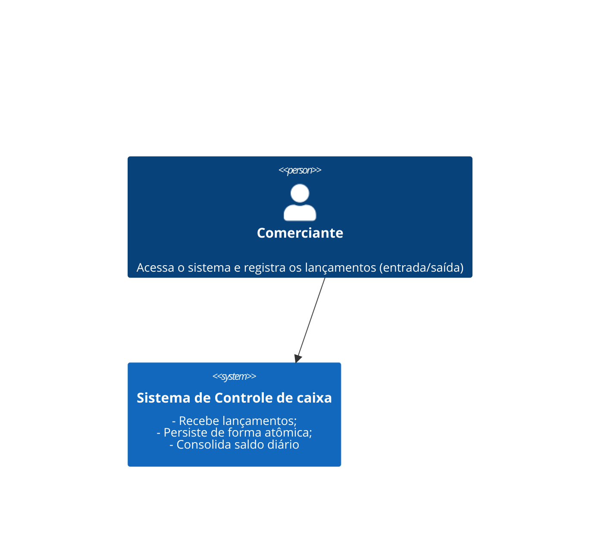
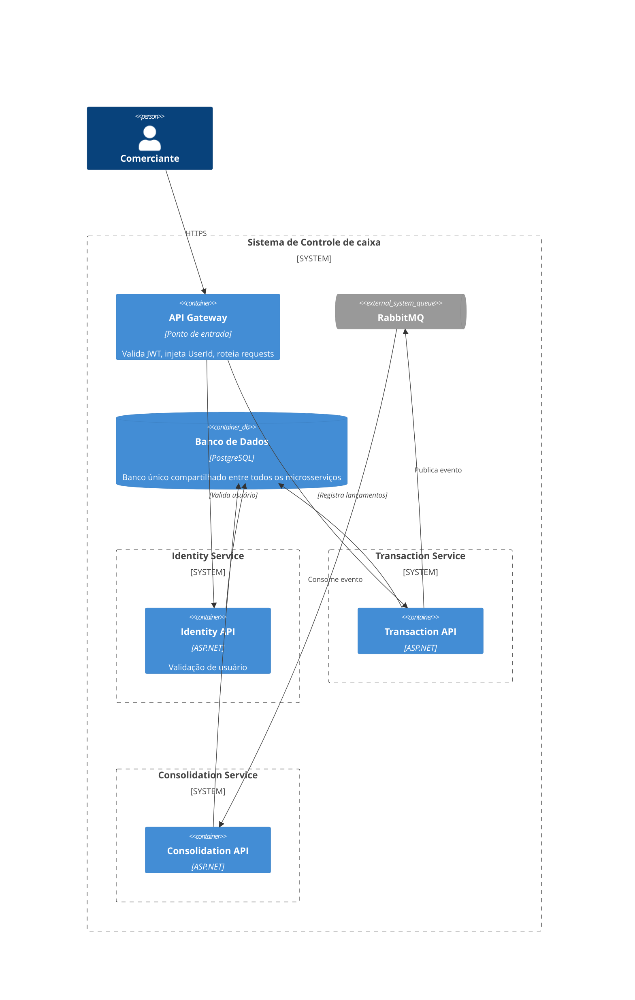

# Documento de arquitetura

## C4

### Contexto (1o Nível)

```mermaid
C4Context
  Person(user, "Comerciante", "Acessa o sistema e registra os lançamentos (entrada/saída)")
  System(cashflow, "Sistema de Controle de caixa", "- Recebe lançamentos;<br />- Persiste de forma atômica;<br />- Consolida saldo diário")

  Rel(user, cashflow, "")
```

### Container (2o Nível)

```mermaid
C4Container
  Person(user, "Comerciante", "")

  System_Boundary(cashflow, "Sistema de Controle de caixa") {
    Container(api, "API Gateway", "Ponto de entrada", "Valida JWT, injeta UserId, roteia requests")

    SystemQueue_Ext(rabbit, "RabbitMQ", "")

    ContainerDb(db, "Banco de Dados", "PostgreSQL", "Banco único compartilhado entre todos os microsserviços")

    System_Boundary(identity, "Identity Service") {
      Container(identity_api, "Identity API", "ASP.NET", "Validação de usuário")
    }

    System_Boundary(transaction, "Transaction Service") {
      Container(trx_api, "Transaction API", "ASP.NET")
    }

    System_Boundary(consolidation, "Consolidation Service") {
      Container(consolidation_api, "Consolidation API", "ASP.NET")
    }

    Rel(user, api, "HTTPS", "")

    Rel(api, identity_api, "", "Valida usuário")
    Rel(api, trx_api, "", "Registra lançamentos")

    Rel(identity_api, db, "", "")
    Rel(trx_api, db, "", "")
    Rel(consolidation_api, db, "", "")

    Rel(trx_api, rabbit, "Publica evento", "")
    Rel(rabbit, consolidation_api, "Consome evento", "")
  }
```
